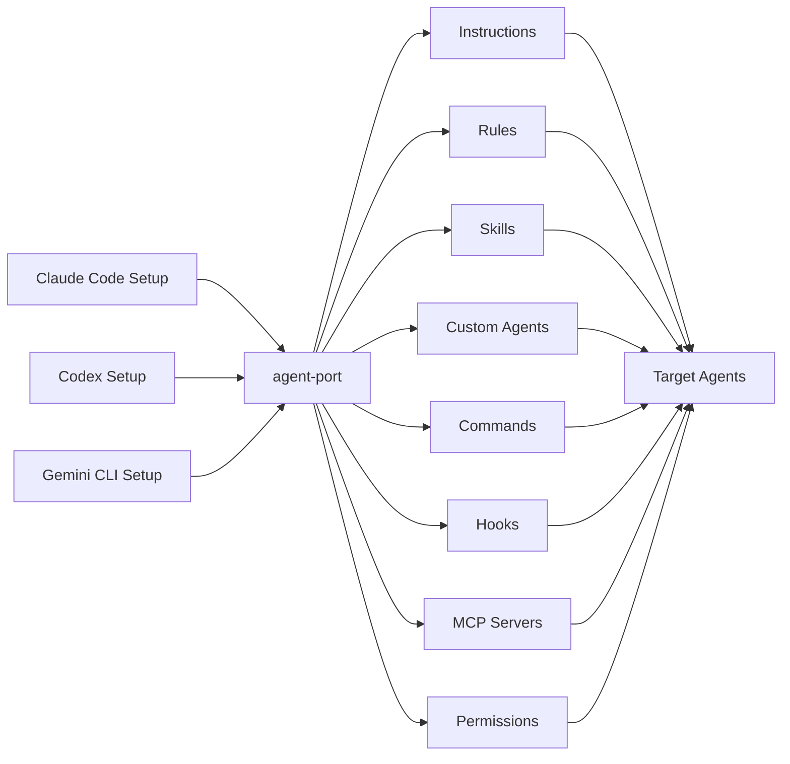
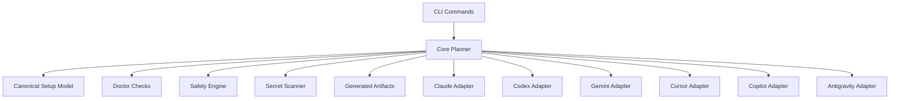

# agent-port

> Bring your best agent setup everywhere.

You already tuned one AI coding agent. Your other agents should not have to start from zero.

`agent-port` reads the setup you already use — instructions, rules, skills, custom agents, commands, hooks, MCP servers, permissions, and settings — then builds a safe, reviewable plan to port compatible pieces to Claude Code, Codex, Gemini CLI, Cursor, GitHub Copilot, and Antigravity.

It is not just an MCP sync tool. It is a portability layer for AI coding agent environments.

## The Problem

Modern development teams often use several AI coding agents side by side. Each tool has its own files, directories, memories, commands, rules, MCP settings, and safety controls. Moving a well-tuned setup from one agent to another usually means rediscovering paths, rewriting instructions, and manually copying fragile config.

`agent-port` starts with the setup you already have and turns it into a dry-run-first migration plan. Exact matches are mapped natively. Uncertain conversions become generated review artifacts. Risky pieces, such as hooks and permission expansion, are called out clearly instead of being silently applied.

## Quick Start

```bash
npm install -g agent-port
agent-port scan
agent-port from claude to codex gemini cursor
agent-port from claude to gemini --apply --yes
agent-port doctor
```

For local development:

```bash
npm install
npm run build
npm link
agent-port scan
```

## Demo

```bash
agent-port from claude to codex gemini cursor
```

```text
Source: Claude Code

Found:
  Instructions     1
  Skills           2
  Custom agents    3
  Commands         4
  Hooks            1
  MCP servers      3
  Permissions      1

Plan:
  Codex
    + create/update AGENTS.md from CLAUDE.md
    ≈ convert 2 skills to portable skill cards
    ≈ convert 3 custom agents to prompt profiles
    ≈ convert 4 commands to prompt templates
    ! hook "pre-tool-use" requires manual review
    + add 3 MCP servers

  Gemini CLI
    + create/update GEMINI.md from CLAUDE.md
    ≈ export skills, custom agents, and commands as generated artifacts
    ! hook "pre-tool-use" requires manual review
    + add 3 MCP servers

No files were changed.
Run again with --apply to write changes.
```

## Supported Agents

| Agent | Source support | Target support | Notes |
| --- | --- | --- | --- |
| Claude Code | MVP | MVP | Reads `CLAUDE.md`, `.claude`, settings, skills, agents, commands, hooks, MCP servers. |
| Codex | MVP | MVP | Reads `AGENTS.md` and `config.toml`; writes `AGENTS.md` and best-effort MCP TOML. |
| Gemini CLI | MVP | MVP | Reads and writes `GEMINI.md` plus `.gemini/settings.json`. |
| Cursor | Best effort | MVP | Reads `.cursor/rules` and `.cursor/mcp.json`; writes generated Cursor rules and MCP JSON. |
| GitHub Copilot | Best effort | MVP | Reads `.github/copilot-instructions.md` and VS Code MCP/settings files. |
| Antigravity | Experimental | Generated artifacts | Detects `.antigravity` when present and creates reviewable fallback artifacts. |

## Setup Categories

| Category | Behavior |
| --- | --- |
| Settings | Parsed where formats are known; ambiguous settings require manual review. |
| Instructions | Treated as first-class components and mapped to native instruction files when possible. |
| Rules | Preserved as Cursor rules or generated Markdown rule artifacts. |
| Memories | Sensitive by default; personal memories are blocked from automatic copying. |
| Skills | Preserved as portable skill cards when no native target concept is known. |
| Custom agents | Exported as custom agent cards with role, prompt, tools, hints, and source files. |
| Commands | Converted to prompt templates or generated command cards. |
| Hooks | Detected and exported for review, never executed. |
| MCP servers | Converted to known native config formats while preserving env references. |
| Permissions | Permission expansion is flagged and not silently applied. |
| Environment references | `${VAR}` references are preserved and checked by `doctor`. |

## Product Flow



## Architecture



## Safety Model

`agent-port` is dry-run-first. Commands that can write files require `--apply`, and non-interactive writes require `--apply --yes`.

The apply step creates backups before modifying existing files:

```text
settings.json.agent-port-backup-YYYYMMDDHHMMSS
```

Safety rules:

- Hooks are never executed or installed automatically.
- Plaintext secret-looking values are detected and redacted before generated files are written.
- Environment references such as `${GITHUB_TOKEN}` are preserved.
- Existing JSON fields are preserved when MCP servers are merged.
- Permission expansion is marked for manual review.
- Generated fallbacks live under `.agent-port/generated/<target>/`.

## Commands

### `agent-port scan`

Scan the current project and home directory for known agent setup artifacts.

```bash
agent-port scan
```

### `agent-port from <source> to <targets...>`

Create a dry-run porting plan.

```bash
agent-port from claude to codex gemini cursor
```

Apply the plan after review:

```bash
agent-port from claude to gemini --apply
agent-port from claude to gemini --apply --yes
```

### `agent-port plan`

Create a plan from flags and optionally save it.

```bash
agent-port plan --from claude --to codex,gemini --out .agent-port/plan.json
```

### `agent-port apply`

Apply a saved plan.

```bash
agent-port apply .agent-port/plan.json --yes
```

### `agent-port doctor`

Validate setup files and report malformed config, missing env vars, secret-like values, risky hooks, broad filesystem access, unsupported transports, and permission risks.

```bash
agent-port doctor
```

### `agent-port init`

Create an optional project-local config file.

```bash
agent-port init
```

### `agent-port export`

Export a detected setup as a portable manifest for debugging, CI, or future import workflows.

```bash
agent-port export claude --out agent-port.manifest.json
```

## Current Scope

This MVP favors practical portability over perfect vendor-specific conversion. When exact support is unclear, `agent-port` generates reviewable Markdown artifacts and labels the conversion as approximate or manual review.

Non-goals for the MVP include multi-agent orchestration, running agents automatically, bidirectional sync, a cloud service, a web dashboard, deleting target config, and secret vault integration.

## Roadmap

- [ ] More precise Claude Code settings import
- [ ] More precise Codex profile and MCP support
- [ ] Native skill conversion where supported
- [ ] Native custom agent conversion where supported
- [ ] Rules and command migration improvements
- [ ] Team policy files
- [ ] CI mode
- [ ] MCP and hook security audit presets
- [ ] Plugin API for community adapters
- [ ] Compatibility matrix generated from adapters

## Contributing

Contributions are welcome. Good first areas include adapter fixtures, compatibility notes for agent-specific formats, additional safety checks, and parser tests for real-world config examples.

Before opening a pull request:

```bash
npm install
npm run build
npm test
```

Please keep conversions conservative. If a target format is uncertain, prefer a generated artifact plus a clear warning over a confident write to the wrong place.

## License

MIT
