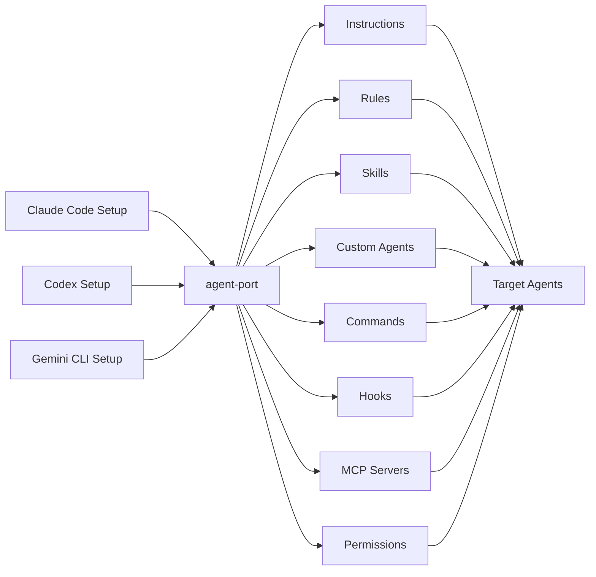
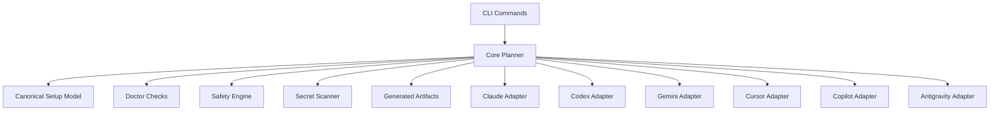

# Goal: Build `agent-port` — Port Your AI Coding Agent Setup Across Tools

## Product concept

`agent-port` is an open-source CLI that helps developers carry their carefully tuned AI coding agent setup from one tool to another.

Modern developers often use several AI coding agents side by side:

- Claude Code
- Codex CLI
- Gemini CLI
- Cursor CLI
- GitHub Copilot CLI
- Antigravity CLI

Each tool has its own way to define configuration, project instructions, rules, memories, custom agents, skills, slash commands, hooks, MCP servers, permissions, environment variables, and workspace settings.

The result is painful: developers invest time in one agent, then have to manually recreate a similar setup in every other agent.

`agent-port` solves this by treating an existing agent setup as the starting point and generating safe, reviewable porting plans for other agents.

The core message is:

> Bring your best agent setup everywhere.

Alternative tagline:

> Stop rebuilding the same AI coding environment five times.

This is not only an MCP sync tool. MCP servers are just one configuration category. The product goal is broader: **port as much of an AI agent environment as safely and meaningfully possible**.

---

## Target outcome

Implement a usable MVP that can be published as an OSS repository.

The finished repository must include:

1. A working TypeScript CLI named `agent-port`.
2. A canonical internal model for AI coding agent setup components.
3. Adapter architecture for multiple AI coding agents.
4. Detection and planning logic for:
   - Claude Code
   - Codex CLI
   - Gemini CLI
   - Cursor CLI
   - GitHub Copilot CLI / VS Code Copilot configuration
   - Antigravity CLI
5. Best-effort support for these setup categories:
   - Global settings
   - Project settings
   - Instruction files
   - Rules
   - Memories
   - Custom agents / subagents
   - Skills
   - Slash commands / custom commands
   - Hooks / lifecycle commands
   - MCP servers
   - Tool permissions / allowlists / denylists
   - Environment variable references
6. Safe dry-run-first porting flow.
7. Basic apply support where config locations and formats are known.
8. `scan`, `from`, `plan`, `apply`, `doctor`, `init`, and `export` commands.
9. A polished English README.
10. Visual terminal examples in the README.
11. Mermaid diagrams for product flow and architecture.
12. Good package metadata for OSS publication.
13. Tests for parser, planner, adapters, and safety checks.
14. No hardcoded secrets.
15. No destructive overwrite without explicit confirmation or `--yes`.

---

## Product positioning

`agent-port` should not be positioned as "one MCP config for all tools".

It should be positioned as:

> A portability layer for AI coding agent environments.

More concrete description:

> `agent-port` reads the agent setup you already use — instructions, rules, skills, custom agents, commands, MCP servers, permissions, and settings — then builds a safe plan to port the compatible parts to other AI coding agents.

---

## Design principles

### 1. Existing setup first

Do not require users to write a new universal config file before they get value.

The primary workflow is:

```bash
agent-port from claude to codex gemini cursor
```

This reads the existing Claude Code setup, creates a porting plan, and applies changes only after confirmation.

### 2. Broad setup portability, not MCP-only

The canonical model must represent the whole agent environment, including:

- settings
- instructions
- rules
- skills
- custom agents
- commands
- hooks
- MCP servers
- permissions
- environment references

MCP support is important, but it must be one category among many.

### 3. Preserve intent when exact conversion is impossible

Many agent-specific features do not have a perfect equivalent in other tools.

When exact conversion is impossible, the tool should:

1. Preserve the original source artifact.
2. Generate a compatible approximation if safe.
3. Mark the change as `partial` or `manual-review`.
4. Explain what could not be translated.

Example:

```text
! Claude subagent "security-reviewer" cannot be represented natively in Gemini CLI.
  Generated docs/agent-port/generated/gemini/security-reviewer.md for manual use.
```

### 4. Dry-run by default

Commands that can modify files must show a plan first.

Writing changes should require:

```bash
--apply
```

or non-interactive confirmation:

```bash
--apply --yes
```

### 5. Safe by default

The tool must not blindly copy secrets or destructive settings.

If a config contains environment variables, preserve references such as:

```bash
${GITHUB_TOKEN}
```

Do not copy resolved token values into generated config.

Warn on plaintext secret-like values.

### 6. Adapter-based

Each agent integration must be implemented as an adapter.

Adapters should support:

- detection
- reading setup artifacts
- normalization to the canonical model
- planning target changes
- applying safe changes
- warnings for unsupported or partial conversions

### 7. Friendly CLI output

The terminal output should be readable and visually pleasant.

Use symbols like:

```text
✓ detected
+ add
~ update
≈ approximate
! warning
- skip
? unknown
```

Use color where helpful, but keep output understandable without color.

---

## MVP feature scope

### Supported source agents

For MVP, support these as source agents:

- `claude`
- `codex`
- `gemini`

### Supported target agents

For MVP, support these as target agents:

- `claude`
- `codex`
- `gemini`
- `cursor`
- `copilot`
- `antigravity`

If exact config support is uncertain for a target, implement a conservative adapter that:

1. Detects likely config locations.
2. Reads known files if present.
3. Produces clear warnings for unsupported apply operations.
4. Generates suggested artifacts under `.agent-port/generated/<target>/`.
5. Does not claim complete support.

---

## Setup categories

The implementation must treat the following as first-class categories.

### 1. Settings

General agent settings, including model preferences, approval mode, sandbox mode, telemetry flags, default profiles, and behavior preferences.

Examples:

- Codex `config.toml`
- Gemini `settings.json`
- Claude local/global config files when present
- Cursor project settings where applicable

Conversion rule:

- Convert only clearly equivalent settings.
- Do not guess dangerous settings.
- Mark ambiguous settings as manual review.

### 2. Instructions

Long-form agent instructions and project context files.

Examples:

- `CLAUDE.md`
- `AGENTS.md`
- `GEMINI.md`
- Cursor rules or instruction files
- Copilot instruction files

Conversion rule:

- Prefer preserving the original Markdown content.
- Add a short generated header only when necessary.
- Do not rewrite instruction semantics unless explicitly required.

### 3. Rules

Structured or semi-structured rules that guide code generation, review, testing, style, or repository behavior.

Examples:

- `.cursor/rules`
- project-specific rule files
- convention docs used by a specific agent

Conversion rule:

- If the target supports rule files, map to native rule location.
- Otherwise generate Markdown under `.agent-port/generated/<target>/rules/` and reference it from the target instruction file if safe.

### 4. Memories

Persistent user or project memory-like information used by an agent.

Conversion rule:

- Treat memories as sensitive.
- Never copy personal memories by default.
- Project memories may be ported only if they are located in the repository and are not secret-like.
- Always show a warning before applying memory-related changes.

### 5. Skills

Reusable agent skills or capability bundles.

Examples:

- Claude Code skills
- custom skill directories
- reusable prompt bundles
- tool-specific skill definitions

Conversion rule:

- Preserve the skill directory structure when possible.
- Convert metadata to the target's closest supported format.
- If no native target concept exists, generate a portable Markdown skill card.
- Mark conversion as `native`, `approximate`, or `manual`.

### 6. Custom agents / subagents

Specialized agent definitions such as reviewers, planners, testers, security auditors, or documentation writers.

Examples:

- Claude subagents
- Codex profiles or task-specific instructions
- custom agent prompt files
- local agent manifests

Conversion rule:

- Preserve agent name, description, role, system prompt, allowed tools, and activation hints.
- Convert to native target custom agent format if known.
- Otherwise generate a target-specific prompt artifact and optionally reference it from the main instruction file.

### 7. Commands

Slash commands, custom commands, prompt shortcuts, or task templates.

Examples:

- Claude slash commands
- project command prompt files
- custom workflow commands

Conversion rule:

- Convert simple prompt-only commands where possible.
- Commands requiring unsupported tool calls should be marked manual-review.
- Generated fallback files should go under `.agent-port/generated/<target>/commands/`.

### 8. Hooks

Lifecycle hooks or shell commands that run before or after agent actions.

Conversion rule:

- Treat hooks as high risk.
- Never apply executable hooks without explicit confirmation.
- Show command content in the plan.
- Mark as `dangerous` if it modifies files, runs network commands, or executes package managers.

### 9. MCP servers

MCP server definitions including stdio, SSE, HTTP, and streamable HTTP transports.

Conversion rule:

- Convert supported transports to target-native config.
- Warn on unsupported transports.
- Preserve env references.
- Do not inline secrets.

### 10. Permissions

Tool permissions, allowed commands, denied commands, workspace trust, sandbox mode, approval mode, and remote access policies.

Conversion rule:

- Treat permission weakening as high risk.
- Never silently grant broader permissions in a target.
- If source is more permissive than target default, require explicit confirmation.

### 11. Environment references

Environment variables required by MCP servers, hooks, commands, or skills.

Conversion rule:

- Preserve references.
- Detect missing required variables.
- Warn on plaintext secrets.
- Do not create `.env` files by default.

---

## CLI commands

### `agent-port scan`

Scans the local environment and reports detected agents and known setup artifacts.

Example:

```bash
agent-port scan
```

Expected output style:

```text
agent-port

Detected agents

  ✓ Claude Code        ~/.claude, CLAUDE.md
  ✓ Codex              ~/.codex/config.toml, AGENTS.md
  ✓ Gemini CLI         ~/.gemini/settings.json
  ✓ Cursor             .cursor/rules, .cursor/mcp.json
  ✓ GitHub Copilot     .github/copilot-instructions.md, .vscode/mcp.json
  ? Antigravity        config path not found

Setup inventory

  Claude Code
    Instructions       1
    Rules              0
    Skills             2
    Custom agents      3
    Commands           4
    Hooks              1
    MCP servers        3
    Permissions        1

  Codex
    Instructions       1
    Rules              0
    Skills             0
    Custom agents      0
    Commands           0
    Hooks              0
    MCP servers        1
    Permissions        1
```

### `agent-port from <source> to <targets...>`

Creates a porting plan from one agent to one or more target agents.

Example:

```bash
agent-port from claude to codex gemini cursor
```

Default behavior must be dry-run.

Example output:

```text
Source: Claude Code

Found in source

  Instructions
    - CLAUDE.md

  Skills
    - code-review
    - release-notes

  Custom agents
    - security-reviewer
    - test-writer
    - docs-maintainer

  Commands
    - /review
    - /test
    - /explain

  Hooks
    - pre-tool-use

  MCP servers
    - github
    - filesystem
    - playwright

Plan

  Codex
    + create/update AGENTS.md from CLAUDE.md
    ≈ convert 2 skills to portable skill cards
    ≈ convert 3 custom agents to Codex prompt profiles
    ≈ convert 3 slash commands to prompt templates
    ! hook "pre-tool-use" requires manual review
    + add github MCP
    + add filesystem MCP
    ! playwright MCP transport requires manual review

  Gemini CLI
    + create/update GEMINI.md from CLAUDE.md
    ≈ convert 2 skills to generated Gemini instruction artifacts
    ≈ convert 3 custom agents to generated prompt artifacts
    ≈ convert 3 slash commands to generated prompt artifacts
    ! hook "pre-tool-use" requires manual review
    + add github MCP
    + add filesystem MCP
    + add playwright MCP

  Cursor
    + create .cursor/rules/agent-port-generated.mdc
    ≈ convert instructions and rules into Cursor rule files
    ≈ export skills, custom agents, and commands under .agent-port/generated/cursor
    + create/update .cursor/mcp.json

No files were changed.
Run again with --apply to write changes.
```

### `agent-port from <source> to <targets...> --apply`

Applies the generated plan after confirmation.

Example:

```bash
agent-port from claude to codex gemini --apply
```

Prompt:

```text
Apply these changes? [y/N]
```

Also support non-interactive mode:

```bash
agent-port from claude to codex gemini --apply --yes
```

### `agent-port plan`

Creates a plan from explicit flags.

Example:

```bash
agent-port plan --from claude --to codex,gemini,cursor
```

### `agent-port apply`

Applies a previously saved plan.

Example:

```bash
agent-port plan --from claude --to codex,gemini --out .agent-port/plan.json
agent-port apply .agent-port/plan.json
```

### `agent-port doctor`

Validates the current environment.

Checks:

- missing config directories
- invalid JSON
- invalid TOML
- invalid YAML where applicable
- duplicate setup component IDs
- missing environment variable references
- plaintext secret-looking values
- broad filesystem access
- executable hooks
- unsupported transport types
- target config not writable
- instruction file conflicts
- unsafe permission expansion
- custom agent definitions without names or descriptions
- skills missing metadata

Example output:

```text
Doctor report

  ✓ Claude Code config is readable
  ✓ Codex config is readable
  ! Gemini CLI has invalid JSON in ~/.gemini/settings.json
  ! Skill "release-notes" is missing a description
  ! Custom agent "security-reviewer" allows shell execution
  ! Hook "pre-tool-use" runs a package manager command
  ! MCP server "filesystem" exposes /Users/naoto
  ! MCP server "github" references missing env var GITHUB_TOKEN
```

### `agent-port init`

Creates an optional project-local config file:

```text
agent-port.config.json
```

Example:

```json
{
  "defaultSource": "claude",
  "defaultTargets": ["codex", "gemini", "cursor"],
  "generatedDir": ".agent-port/generated",
  "portCategories": [
    "settings",
    "instructions",
    "rules",
    "skills",
    "customAgents",
    "commands",
    "hooks",
    "mcpServers",
    "permissions"
  ],
  "safety": {
    "copyPersonalMemory": false,
    "applyExecutableHooks": false,
    "allowPermissionExpansion": false
  }
}
```

### `agent-port export`

Exports a detected source setup into a portable manifest.

Example:

```bash
agent-port export claude --out agent-port.manifest.json
```

This is useful for debugging, CI, and future import workflows.

---

## Canonical data model

Create a shared internal model that is broad enough to represent all supported setup categories.

```ts
export type AgentId =
  | "claude"
  | "codex"
  | "gemini"
  | "cursor"
  | "copilot"
  | "antigravity";

export type PortabilityLevel =
  | "native"
  | "approximate"
  | "manual"
  | "unsupported";

export type SetupComponentKind =
  | "settings"
  | "instruction"
  | "rule"
  | "memory"
  | "skill"
  | "custom-agent"
  | "command"
  | "hook"
  | "mcp-server"
  | "permission"
  | "env-reference";

export type RiskLevel = "low" | "medium" | "high" | "dangerous";

export interface SourceLocation {
  agent: AgentId;
  path: string;
  format?: "json" | "toml" | "yaml" | "markdown" | "directory" | "unknown";
}

export interface CanonicalSetupComponentBase {
  id: string;
  kind: SetupComponentKind;
  title: string;
  source: SourceLocation;
  portability: PortabilityLevel;
  risk: RiskLevel;
  raw?: unknown;
  warnings: string[];
}

export interface CanonicalSettings extends CanonicalSetupComponentBase {
  kind: "settings";
  values: Record<string, unknown>;
}

export interface CanonicalInstruction extends CanonicalSetupComponentBase {
  kind: "instruction";
  content: string;
}

export interface CanonicalRule extends CanonicalSetupComponentBase {
  kind: "rule";
  content: string;
  globs?: string[];
  alwaysApply?: boolean;
}

export interface CanonicalMemory extends CanonicalSetupComponentBase {
  kind: "memory";
  content: string;
  scope: "project" | "user" | "unknown";
}

export interface CanonicalSkill extends CanonicalSetupComponentBase {
  kind: "skill";
  name: string;
  description?: string;
  content?: string;
  files: string[];
  metadata?: Record<string, unknown>;
}

export interface CanonicalCustomAgent extends CanonicalSetupComponentBase {
  kind: "custom-agent";
  name: string;
  description?: string;
  systemPrompt?: string;
  allowedTools?: string[];
  activationHints?: string[];
  files: string[];
  metadata?: Record<string, unknown>;
}

export interface CanonicalCommand extends CanonicalSetupComponentBase {
  kind: "command";
  name: string;
  description?: string;
  prompt?: string;
  command?: string;
  args?: string[];
  files: string[];
}

export interface CanonicalHook extends CanonicalSetupComponentBase {
  kind: "hook";
  name: string;
  event: string;
  command?: string;
  args?: string[];
  content?: string;
}

export type TransportType =
  | "stdio"
  | "sse"
  | "http"
  | "streamable-http"
  | "unknown";

export interface CanonicalMcpServer extends CanonicalSetupComponentBase {
  kind: "mcp-server";
  name: string;
  transport: TransportType;
  command?: string;
  args?: string[];
  url?: string;
  env?: Record<string, string>;
  disabled?: boolean;
}

export interface CanonicalPermission extends CanonicalSetupComponentBase {
  kind: "permission";
  name: string;
  allow?: string[];
  deny?: string[];
  approvalMode?: string;
  sandboxMode?: string;
}

export interface CanonicalEnvReference extends CanonicalSetupComponentBase {
  kind: "env-reference";
  name: string;
  required: boolean;
  usedBy: string[];
}

export type CanonicalSetupComponent =
  | CanonicalSettings
  | CanonicalInstruction
  | CanonicalRule
  | CanonicalMemory
  | CanonicalSkill
  | CanonicalCustomAgent
  | CanonicalCommand
  | CanonicalHook
  | CanonicalMcpServer
  | CanonicalPermission
  | CanonicalEnvReference;

export interface CanonicalAgentSetup {
  agent: AgentId;
  displayName: string;
  detected: boolean;
  configPaths: string[];
  components: CanonicalSetupComponent[];
  warnings: string[];
}

export interface Change {
  type:
    | "add"
    | "update"
    | "skip"
    | "warn"
    | "create-file"
    | "manual-review"
    | "approximate";
  target: AgentId;
  componentKind: SetupComponentKind;
  title: string;
  detail?: string;
  path?: string;
  componentId?: string;
  risk: RiskLevel;
  portability: PortabilityLevel;
}

export interface PortPlan {
  source: CanonicalAgentSetup;
  targets: CanonicalAgentSetup[];
  changes: Change[];
  generatedFiles: GeneratedFile[];
}

export interface GeneratedFile {
  target: AgentId;
  path: string;
  content: string;
  reason: string;
}
```

---

## Adapter interface

Implement an adapter interface similar to:

```ts
export interface AgentAdapter {
  id: AgentId;
  displayName: string;

  detect(context: AdapterContext): Promise<DetectionResult>;

  read(context: AdapterContext): Promise<CanonicalAgentSetup>;

  planApply(
    source: CanonicalAgentSetup,
    target: CanonicalAgentSetup,
    context: AdapterContext
  ): Promise<Change[]>;

  generateFiles?(
    source: CanonicalAgentSetup,
    target: CanonicalAgentSetup,
    changes: Change[],
    context: AdapterContext
  ): Promise<GeneratedFile[]>;

  apply?(
    plan: PortPlan,
    context: AdapterContext
  ): Promise<ApplyResult>;
}
```

`AdapterContext` should include:

```ts
export interface AdapterContext {
  cwd: string;
  homeDir: string;
  dryRun: boolean;
  yes: boolean;
  generatedDir: string;
  categories: SetupComponentKind[];
}
```

---

## Expected config handling

Implement best-effort support for these known and likely patterns.

Do not fake complete support. If a format is uncertain, implement detection and generated fallback artifacts with warnings.

### Claude Code

Detect likely paths:

```text
~/.claude
.claude
CLAUDE.md
```

Read categories where present:

- settings
- instructions from `CLAUDE.md`
- skills from known skill directories if present
- custom agents / subagents from known agent directories if present
- slash commands from known command directories if present
- hooks from known settings files if present
- MCP servers from known config if present
- permissions from settings if present

### Codex CLI

Detect likely paths:

```text
~/.codex/config.toml
.codex/config.toml
AGENTS.md
```

Read categories where present:

- settings from TOML config
- instructions from `AGENTS.md`
- MCP servers from TOML config if present
- profiles or profile-like sections as custom-agent candidates if present
- approval/sandbox settings as permissions

### Gemini CLI

Detect likely paths:

```text
~/.gemini/settings.json
.gemini/settings.json
GEMINI.md
```

Read categories where present:

- settings from `settings.json`
- instructions from `GEMINI.md`
- MCP servers from `mcpServers`
- tool include/exclude lists as permissions

### Cursor CLI / Cursor project config

Detect likely paths:

```text
.cursor/mcp.json
.cursor/rules
.cursor/rules/*.mdc
```

Read categories where present:

- rules from `.cursor/rules`
- MCP servers from `.cursor/mcp.json`
- settings if known project settings exist

### GitHub Copilot CLI / VS Code Copilot configuration

Detect likely paths:

```text
.github/copilot-instructions.md
.vscode/mcp.json
.vscode/settings.json
```

Read categories where present:

- instructions from `.github/copilot-instructions.md`
- MCP servers from `.vscode/mcp.json` if present
- settings from `.vscode/settings.json` if relevant

### Antigravity

Detect likely paths:

```text
.antigravity
```

Read only if clear files exist.

If no known config exists, show:

```text
Antigravity support is experimental. No known config file was found.
```

---

## Conversion strategy by category

### Instructions

- Claude `CLAUDE.md` -> Codex `AGENTS.md`
- Claude `CLAUDE.md` -> Gemini `GEMINI.md`
- Claude `CLAUDE.md` -> Cursor generated rule file
- Claude `CLAUDE.md` -> Copilot `.github/copilot-instructions.md`

If target file already exists:

- Do not overwrite blindly.
- Create a merged proposal or append a clearly marked generated section only when safe.
- Otherwise generate a review file under `.agent-port/generated/<target>/instructions/`.

### Rules

- Cursor rules can be exported to Markdown rule artifacts for other agents.
- Generic Markdown rules can be referenced from target instruction files.
- If native rule support exists, write native files.

### Skills

- Native conversion only where target support is known.
- Otherwise generate portable skill cards:

```markdown
# Skill: code-review

## Description
...

## When to use
...

## Procedure
...

## Source
Generated from Claude Code skill: code-review
```

### Custom agents

Generate portable custom agent cards:

```markdown
# Custom Agent: security-reviewer

## Role
...

## System prompt
...

## Allowed tools
...

## Activation hints
...

## Source
Generated from Claude Code custom agent: security-reviewer
```

If target supports native custom agents, use native format. Otherwise store under:

```text
.agent-port/generated/<target>/agents/<agent-name>.md
```

### Commands

Generate command cards:

```markdown
# Command: /review

## Description
...

## Prompt
...

## Source
Generated from Claude Code command: /review
```

If target supports native commands, write native format. Otherwise store under:

```text
.agent-port/generated/<target>/commands/<command-name>.md
```

### Hooks

Hooks are high-risk.

Default behavior:

- detect
- display
- warn
- export for manual review
- do not apply executable hooks unless `--include-hooks --yes` is explicitly provided

### MCP servers

Convert where target native support is known.

- preserve env references
- warn on unsupported transports
- do not inline secrets

### Permissions

Map only obvious equivalents.

Examples:

- read-only/sandbox mode
- approval mode
- allowed tools
- denied tools

If conversion would broaden access, mark as high risk and require explicit confirmation.

---

## Planning behavior

The planner should compare components by:

1. kind
2. stable ID or name
3. normalized content hash
4. source path

Expected change types:

```text
+ add native component
~ update changed component
≈ create approximate conversion
! manual review required
- skip existing equivalent component
```

Examples:

```text
+ create AGENTS.md from CLAUDE.md
≈ convert Claude skill "release-notes" to portable Codex skill card
! hook "pre-tool-use" requires manual review
- skip MCP server "github" because target already has equivalent config
```

---

## Apply behavior

The apply step should:

1. Create backup files before modifying existing config files.
2. Use timestamp suffixes:

```text
settings.json.agent-port-backup-YYYYMMDDHHMMSS
```

3. Preserve unrelated config fields.
4. Pretty-print JSON with 2 spaces.
5. Preserve TOML where practical.
6. Never delete existing components unless explicitly requested.
7. Create missing directories when safe.
8. Put uncertain conversions under `.agent-port/generated/<target>/`.
9. Never execute hooks.
10. Never resolve or write plaintext secrets.

---

## Project structure

Use this structure:

```text
agent-port/
  package.json
  tsconfig.json
  README.md
  LICENSE
  src/
    index.ts
    cli.ts
    core/
      model.ts
      planner.ts
      doctor.ts
      fs.ts
      render.ts
      secrets.ts
      fingerprints.ts
      generated.ts
      safety.ts
    adapters/
      index.ts
      claude.ts
      codex.ts
      gemini.ts
      cursor.ts
      copilot.ts
      antigravity.ts
    commands/
      scan.ts
      from.ts
      plan.ts
      apply.ts
      doctor.ts
      init.ts
      export.ts
  tests/
    planner.test.ts
    secrets.test.ts
    safety.test.ts
    generated.test.ts
    adapters/
      claude.test.ts
      gemini.test.ts
      codex.test.ts
      cursor.test.ts
      copilot.test.ts
```

---

## Dependencies

Use lightweight dependencies.

Recommended:

```json
{
  "commander": "latest",
  "chalk": "latest",
  "ora": "latest",
  "fs-extra": "latest",
  "@iarna/toml": "latest",
  "zod": "latest",
  "fast-glob": "latest",
  "vitest": "latest",
  "tsx": "latest",
  "typescript": "latest"
}
```

---

## README requirements

Create a polished English README.

The README must include:

1. Project title.
2. Short tagline.
3. Engaging intro.
4. Problem statement.
5. Quick start.
6. Demo terminal output.
7. Supported agents table.
8. Supported setup categories table.
9. Architecture diagram using Mermaid.
10. Safety model.
11. Commands reference.
12. Roadmap.
13. Contributing section.
14. License section.

The README should feel attractive and OSS-ready.

Use this visual identity:

```text
agent-port
Bring your best agent setup everywhere.
```

Include this product flow diagram:



Include this architecture diagram:



---

## README copy direction

The README should include copy similar to:

```md
# agent-port

> Bring your best agent setup everywhere.

You already tuned one AI coding agent. Your other agents should not have to start from zero.

`agent-port` reads the setup you already use — instructions, rules, skills, custom agents, commands, hooks, MCP servers, permissions, and settings — then builds a safe, reviewable plan to port compatible pieces to Claude Code, Codex, Gemini CLI, Cursor, GitHub Copilot, and Antigravity.

It is not just an MCP sync tool. It is a portability layer for AI coding agent environments.
```

Include example:

```bash
agent-port from claude to codex gemini cursor
```

And output:

```text
Source: Claude Code

Found:
  Instructions     1
  Skills           2
  Custom agents    3
  Commands         4
  Hooks            1
  MCP servers      3
  Permissions      1

Plan:
  Codex
    + create/update AGENTS.md from CLAUDE.md
    ≈ convert 2 skills to portable skill cards
    ≈ convert 3 custom agents to prompt profiles
    ≈ convert 4 commands to prompt templates
    ! hook "pre-tool-use" requires manual review
    + add 3 MCP servers

  Gemini CLI
    + create/update GEMINI.md from CLAUDE.md
    ≈ export skills, custom agents, and commands as generated artifacts
    ! hook "pre-tool-use" requires manual review
    + add 3 MCP servers

No files were changed.
Run again with --apply to write changes.
```

---

## Testing requirements

Implement tests for the following.

### Planner

- add missing instruction file
- skip equivalent instruction file
- create approximate skill conversion
- create approximate custom agent conversion
- create command conversion artifact
- warn on executable hooks
- add missing MCP server
- skip existing equivalent MCP server
- update changed MCP server
- warn unsupported transport
- warn on permission expansion
- preserve target-specific unrelated fields

### Secret scanner

- detect `sk-`
- detect `ghp_`
- detect `github_pat_`
- detect `xoxb-`
- ignore `${ENV_VAR}` references
- detect token-looking values in settings, hooks, MCP env, and command args

### Safety

- mark executable hooks as high risk
- mark broad filesystem paths as high risk
- mark permission expansion as high risk
- block personal memory copy by default

### Adapters

- parse Gemini `settings.json`
- write Gemini `mcpServers`
- parse Cursor `.cursor/mcp.json`
- parse Cursor rule files
- parse Codex TOML config
- parse Codex `AGENTS.md`
- parse Claude `CLAUDE.md`
- handle missing files gracefully
- handle malformed config gracefully

---

## Quality bar

The implementation should be complete enough that a developer can run:

```bash
npm install
npm run build
npm link
agent-port scan
agent-port from claude to gemini --apply
agent-port doctor
```

The code should:

- be typed
- avoid large monolithic files
- handle missing files gracefully
- avoid crashing on malformed config
- return clear warnings
- include useful test coverage
- have a professional README
- avoid overstating support for uncertain target formats

---

## Non-goals for MVP

Do not implement:

- Multi-agent task orchestration.
- Running agents automatically.
- Concurrent agent execution.
- Bidirectional sync.
- Cloud service.
- Web dashboard.
- Remote registry.
- Deleting target config.
- Secret vault integration.
- Perfect conversion of every vendor-specific feature.

Mention these as possible future work only where appropriate.

---

## Roadmap to include in README

```md
## Roadmap

- [ ] More precise Claude Code settings import
- [ ] More precise Codex profile and MCP support
- [ ] Native skill conversion where supported
- [ ] Native custom agent conversion where supported
- [ ] Rules and command migration improvements
- [ ] Team policy files
- [ ] CI mode
- [ ] MCP and hook security audit presets
- [ ] Plugin API for community adapters
- [ ] Compatibility matrix generated from adapters
```

---

## Implementation priority

Build in this order:

1. Project scaffolding.
2. CLI command routing.
3. Core canonical setup model.
4. File utilities.
5. Secret scanner.
6. Safety engine.
7. Generated artifact writer.
8. Fingerprint/hash utilities.
9. Instruction parser/writer helpers.
10. JSON config helpers.
11. TOML config helpers.
12. Gemini adapter.
13. Cursor adapter.
14. Codex adapter.
15. Claude adapter.
16. Copilot adapter.
17. Antigravity adapter.
18. Planner.
19. Scan command.
20. From command.
21. Plan command.
22. Apply command.
23. Doctor command.
24. Init command.
25. Export command.
26. Apply logic with backups.
27. Tests.
28. README polish.
29. Package metadata.

---

## Acceptance criteria

The task is complete only when all of the following are true:

- `npm run build` succeeds.
- `npm test` succeeds.
- `agent-port scan` works.
- `agent-port doctor` works.
- `agent-port from claude to gemini` produces a readable dry-run plan.
- `agent-port from claude to gemini --apply --yes` can safely write supported target config and generated artifacts.
- Instructions are treated as first-class setup components.
- Skills are detected where possible and exported as portable generated artifacts when native conversion is unavailable.
- Custom agents are detected where possible and exported as portable generated artifacts when native conversion is unavailable.
- Commands are detected where possible and exported as portable generated artifacts when native conversion is unavailable.
- Hooks are detected and warned about, but not executed.
- MCP servers are supported as one category, not the central product definition.
- Existing target config is backed up before modification.
- No plaintext secrets are copied into generated configs.
- README is complete and attractive.
- The repository can be published as OSS without additional explanation.

---

## Final note

Prefer a practical, shippable MVP over theoretical completeness.

The most important user experience is:

```bash
agent-port from claude to codex gemini cursor
```

The user should immediately understand:

1. what setup artifacts were found,
2. which pieces can be ported natively,
3. which pieces require approximation,
4. which pieces are unsafe or unsupported,
5. what files will change,
6. and how to apply the plan safely.

`agent-port` is not an MCP sync tool. It is a portability layer for the entire AI coding agent environment.
